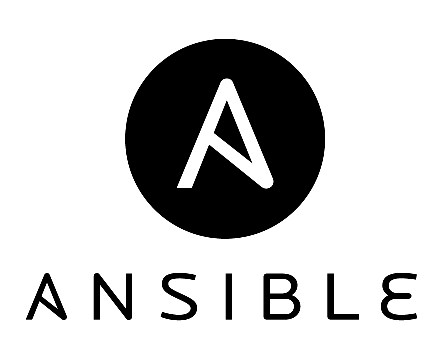

**[Ansible](https://www.ansible.com/)** es una herramienta gratuita y de código abierto para configurar y administrar equipos de manera remota. Fue creada para [Fedora](https://getfedora.org/es/) (distribución derivada [Red Hat](https://www.redhat.com/es)), sin embargo puede ser instalada en prácticamente cualquier distribución GNU/Linux o sistema [_Unix Like_](https://es.wikipedia.org/wiki/Unix-like). 

Junto a otras herramientas similares, constituye una de las [herramientas de automatización](https://es.wikipedia.org/wiki/Anexo:Comparaci%C3%B3n_de_software_libre_para_la_gesti%C3%B3n_de_configuraci%C3%B3n) más populares, entre las que se destacan [Puppet](https://puppet.com/), [Chef](https://www.chef.io/chef/) y [Salt](https://saltstack.com/). 

## ¿Qué puedo hacer con Ansible?
Como cualquier software similar a su tipo, Ansible nos permite automatizar tareas repetitivas con un control total por parte del administrador del sistema. 

* **Infraestructuras**
	  * Servidores: Linux y Windows
	  * Cloud: [Amazon Web Services](https://aws.amazon.com/es/), [Google Cloud Platform](https://cloud.google.com/?hl=es), [Openstack](https://www.openstack.org/), [VMWare](https://www.vmware.com/)
	  * Dispositivos: Routers, Switches
* **Aplicaciones:**
  	* Instalación
  	* Configuración
  	* Administración de servicios

## ¿Por qué Ansible?
Comparada con otras herramientas de automatización, Ansible no requiere de un agente en el cliente para su funcionamiento: se conecta a los nodos a los cuales administra mediante [SSH](https://es.wikipedia.org/wiki/Secure_Shell) en sistemas _UNIX Like_ y con [_Powershell Remoting_](https://docs.microsoft.com/en-us/powershell/scripting/core-powershell/running-remote-commands?view=powershell-6#windows-powershell-remoting) en Windows. 

Por otro lado, posee una sintaxis simple y fácil de aprender, basada en [YAML](https://es.wikipedia.org/wiki/YAML). Por lo mismo, es fácil de mantener por cualquier persona ya que no requiere conocimientos de programación. 

Sin embargo, no es tan potente como administrador o control de versiones y en entornos grandes, requiere configuraciones complejas. 