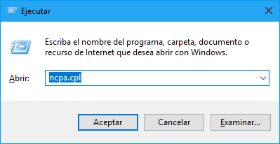
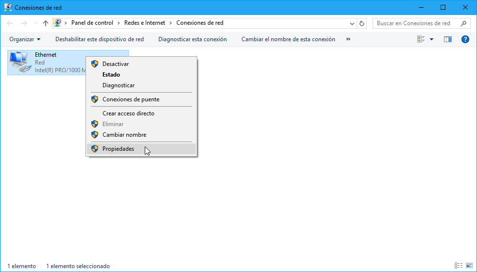
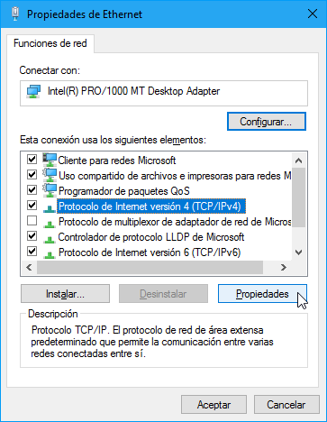
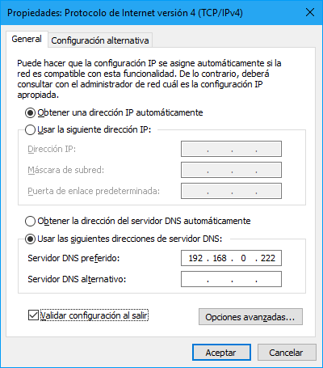

Para que los clientes puedan resolver dominios empleando nuestro servidor tendremos que seguir procedimiento determinado que será distinto dependiendo del sistema operativo en cuestión.  

## Windows

Accedé a "Conexiones de red". Para ello presioná la combinación de teclas <kbd><i class="fab fa-windows"></i></kbd> + <kbd>R</kbd> y escribí `ncpa.cpl` en el formulario del cuadro de dialogo "Ejecutar". Por último, hacé clic en el botón "Aceptar":



Mediante un clic derecho sobre el adaptador de red a través del cual estás conectado a la red (Ethernet, Wifi, etc) y seleccioná la opción "Propiedades" del menú contextual:



Se abrirá la ventana de propiedades del adaptador de red. Seleccioná la opción "Protocolo de Internet versión 4 (TCP/IPv4)": 



Por último, escribí la dirección IP de tu servidor DNS seleccionando la opción "Usar las siguientes direcciones de servidor DNS": 



En el ejemplo, la dirección IP del servidor DNS preferido es `192.168.0.222`: deberás cambiar dicha dirección IP por la dirección IP de tu servidor DNS. En caso de disponer de un servidor DNS adicional, deberá agregarse en formulario "Servidor DNS alternativo". 

## GNU/Linux
Nos dirigimos al directorio `/etc/resolvconf/resolv.conf.d/`:

```apache
cd /etc/resolvconf/resolv.conf.d/
```

Luego abrimos el archivo `base`: 

```apache
sudo vim base
```

Y añadimos el dominio `itel.lan` en el archivo, de manera que nos quede:

```apache
domain itel.lan
search itel.lan
# Dirección IP de nuestro servidor DNS
nameserver 192.168.0.xxx
```

