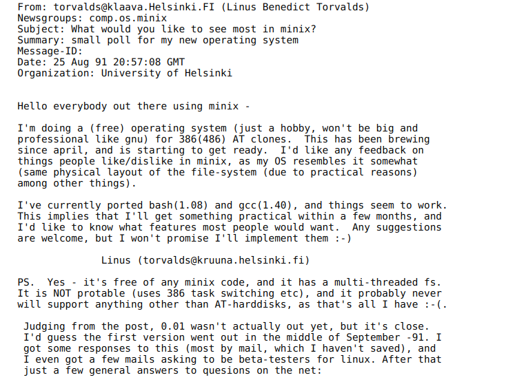

Al año 2020, el kernel de Linux contenía 27,8 millones de líneas de código. ¿Cuál fue el proceso que siguió un proyecto amateur para convertirse en el proyecto de desarrollo de software más grande de la historia?

## Los inicios de Linux

El sistema operativo Linux comenzó como un pasatiempo de un joven estudiante finlandés de 21 años, llamado [Linus Torvalds](https://es.wikipedia.org/wiki/Linus_Torvalds). 

  <figcaption>Linus Torvalds en 1991</figcaption>

He aquí el mensaje que publicó el 25 de agosto de 1991 al liberar la primera versión de su sistema: 

Traducido al idioma español: 

> Hola a todos los que estáis ahí fuera usando minix -
> 
>Estoy haciendo un sistema operativo (libre), (solamente por afición, no será grande ni profesional como el gnu) para clones 386(486) AT. Este ha estado gestándose desde abril, y está comenzando a estar listo. Me gustaría recibir cualquier comentario sobre las cosas que gustan/disgustan en minix, ya que mi SO (Sistema Operativo) se le parece un poco (la misma disposición física del sistema de ficheros, debido a motivos prácticos, entre otras cosas).
> 
>Actualmente he portado bash(1.08) y gcc(1.40), y las cosas parecen funcionar. Esto implica que conseguiré algo práctico dentro de unos meses, y me gustaría saber qué características quiere la mayoría de la gente. Cualquier sugerencia es bienvenida, pero no prometeré que las implementaré :-)
> 
>Linus Benedict Torvalds (torvalds@kruuna.helsinki.fi)
> 
>PD. Sí – está libre de cualquier código de minix, y tiene un sistema de ficheros multi-hilo. NO es portable (usa el cambio de tareas del 386 etc), y probablemente nunca soporte otra cosa que no sean los discos duros AT, porque es todo lo que tengo :-(.

Muchos ven en este mensaje el nacimiento de Linux. A decir verdad, Linus sólo había escrito el kernel del sistema, no el sistema completo. 

Años antes un tal [Richard Stallman](https://es.wikipedia.org/wiki/Richard_Stallman) físico y programador estadounidense estaba cocinando junto a su equipo un proyecto de software libre que finalmente fue liberado en 1983: [el proyecto GNU](https://www.gnu.org/home.es.html). Dos años más tarde, fundaría la [Free Software Foundation](https://www.fsf.org/es). 

Finalmente, ambos sumaron esfuerzos, ya que uno aportaba lo que le faltaba al otro. Así nació [Linux ó GNU/Linux](https://es.wikipedia.org/wiki/Controversia_por_la_denominaci%C3%B3n_GNU/Linux) (Kernel Linux + Software GNU)

<iframe width="560" height="315" src="https://www.youtube.com/embed/MNXIXDbEmVc" title="YouTube video player" frameborder="0" allow="accelerometer; autoplay; clipboard-write; encrypted-media; gyroscope; picture-in-picture" allowfullscreen></iframe>

## ¿Por qué usar GNU/Linux?

Probablemente te hayas preguntado por qué utilizamos GNU/Linux y software libre durante el desarrollo de la materia. Lo cierto es que no existe una única razón. A continuación, encontrarás algunas de ellas: 

##Porque existen razones éticas y pedagógicas para usarlo#
Existen razones de peso para utilizar software libre en la educación:

* [Por qué las instituciones educativas deben utilizar y enseñar software libre](https://www.gnu.org/education/edu-why.html)
* [Por qué las escuelas deben usar exclusivamente software libre](https://www.gnu.org/education/edu-schools.es.html)
* [Software libre y educación](https://www.gnu.org/education/education.es.html)
* [El software libre en la educación](https://es.wikibooks.org/wiki/El_software_libre_en_la_educaci%C3%B3n/Teor%C3%ADa)

> **Software Libre: técnicamente viable, económicamente sostenible y socialmente justo** _Jordi Mas i Hernàndez_

##Porque constituye el presente y el futuro de la tecnología

En la actualidad, es el sistema operativo más utilizado a escala mundial por:

* Servidores [web](http://news.netcraft.com/archives/category/web-server-survey/), de [resolución de nombres](https://en.wikipedia.org/wiki/Root_name_server#Root_server_addresses), de [correo electrónico](http://www.securityspace.com/s_survey/data/man.201512/mxsurvey.html), etc., que mantienen viva a la red de redes: internet.
* Empresas como [Google](http://toolbar.netcraft.com/site_report?url=google.com), [Facebook](http://toolbar.netcraft.com/site_report?url=facebook.com) y [Twitter](http://toolbar.netcraft.com/site_report?url=twitter.com). 
* Más del 98% de las [supercomputadoras](http://www.top500.org/statistics/list/).
* Smartphones con el  sistema Android](https://www.idc.com/prodserv/smartphone-os-market-share.jsp).
* La [ISS o Estación Espacial Internacional](https://es.wikipedia.org/wiki/Estaci%C3%B3n_Espacial_Internacional) la cual [utiliza GNU/Linux](http://www.20minutos.es/noticia/1809627/0/nasa/sistema-operativo/windows-por-linux/).
* El [CERN, el mayor laboratorio de investigación en física de partículas del mundo](https://es.wikipedia.org/wiki/Organizaci%C3%B3n_Europea_para_la_Investigaci%C3%B3n_Nuclear) creó la máquina más grande y costosa jamás construida por el hombre, el [Large Hadron Collider](http://home.cern/topics/large-hadron-collider) que [usa GNU/Linux](https://linux.web.cern.ch/linux/scientific.shtml).
* Empresas como Intel, al proponerlo como [estándar de desarrollo para IoT _Internet of Things_ o _Internet de las cosas_](https://software.intel.com/es-es/iot/pulsar).
* La mayoría de los Smart TVs, dispositivos de red (routers, switches, repetidores, etc), así como diversos electrodomésticos y todo tipo de [dispositivos embebidos](http://linuxgizmos.com/).
* Computación en la nube: [Amazon Web Services](https://aws.amazon.com/es/), [Microsoft Azure](https://azure.microsoft.com/es-es/documentation/articles/virtual-machines-linux-opensource/) (sí, leíste bien: Microsoft usa GNU/Linux), [VMware ESXi](https://es.wikipedia.org/wiki/VMware_ESX), [Xen](https://es.wikipedia.org/wiki/Xen), [OpenVZ](https://es.wikipedia.org/wiki/OpenVZ), [OpenStack](https://es.wikipedia.org/wiki/OpenStack), etc.
* Contenedores: [Docker](https://es.wikipedia.org/wiki/Docker_%28software%29), [LXC](https://es.wikipedia.org/wiki/LXC), etc.
* Automóviles de última generación [1](http://www.telam.com.ar/notas/201407/70241-linux-presento-su-alternativa-de-codigo-abierto-para-los-automoviles-conectados.html) [2](https://www.automotivelinux.org/) [3](http://www.siliconweek.es/workspace/toyota-implementara-linux-en-sus-vehiculos-13472), como el [Modelo S de Tesla Motors](https://www.teslamotors.com/es_MX/models?redirect=no).
* Hackers [1](http://www.20minutos.es/noticia/1585441/0/luis-ivan-cuende/holalabs/hack-now/) [2](http://www.hackinglinuxexposed.com/about/why_linux.html) [3](http://lamiradadelreplicante.com/2015/07/28/los-hackers-de-mr-robot-usan-kali-linux/).

GNU/Linux es el [proyecto de software más grande de la historia informática](https://www.youtube.com/watch?v=YkzwTk_apMU), gracias al aporte de [numerosas empresas](http://www.linuxfoundation.org/about/members) y [voluntarios](https://www.openhub.net/p/linux/contributors) repartidos por todo el planeta. Las tendencias de crecimiento actuales no paran de aumentar y nada parece decir ocurrirá de otra manera. 