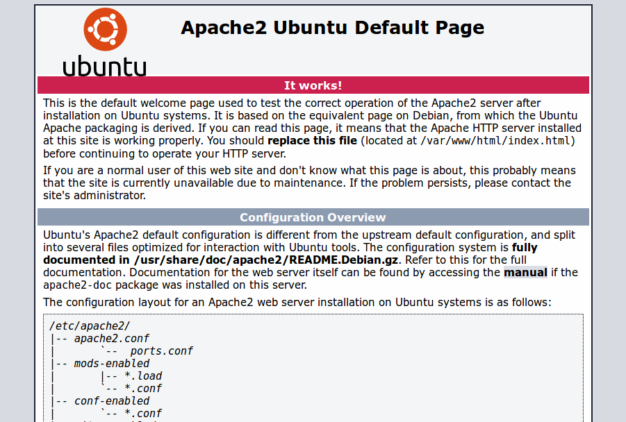
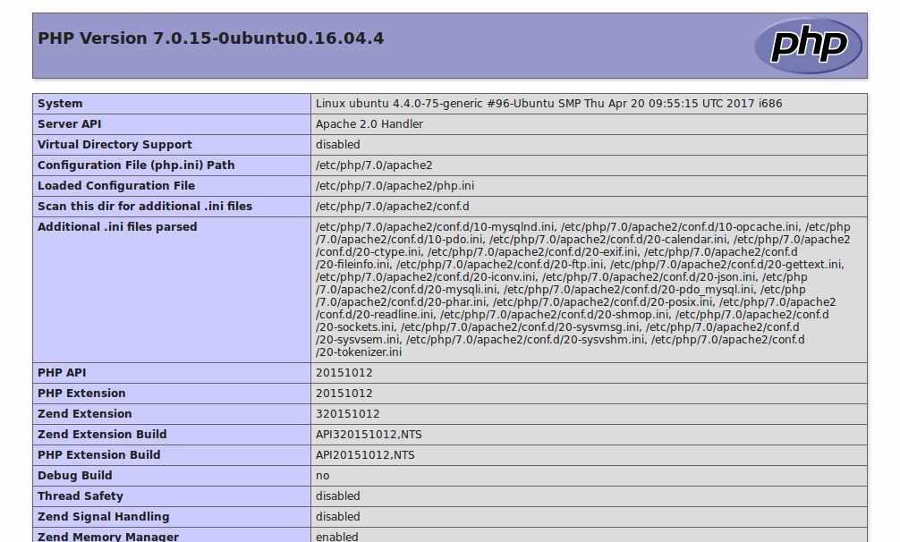
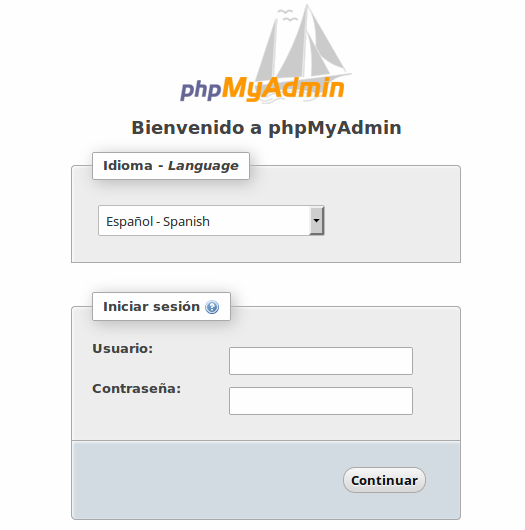

!!! warning "Ingreso de datos"
	Durante la instalación se solicitará en varias ocasiones el ingreso de información por parte del usuario. Por ejemplo, la contraseña del usuario root de la base de datos, o el tipo de servicio a instalar si usamos `tasksel`. Conviene prestar atención en cada paso para evitar errores de configuración. 

Para disponer de un servidor web **LAMP** ejecutaremos los comandos que se indican a continuación. 

### Instalación de Apache

```bash
sudo apt install apache2 -y
```

Podemos comprobar la instalación ejecutando: 

```bash
apache2 -v
```

### Instalación de MaríaDB

```bash
sudo apt install mariadb-server -y
```

Podemos comprobar la instalación ejecutando: 

```bash
mariadb --version
```

El paso siguiente será establecer la contraseña de la base de datos

```bash
sudo mysql_secure_installation
```

### Instalación de PHP 7.4

```bash
sudo apt install php -y
```

Podemos comprobar la instalación ejecutando: 

```bash
php --version
```

#### Comandos útiles de Apache

Podemos reiniciar Apache de la siguiente manera:  

```bash
sudo systemctl restart apache2
```

O bien: 

```bash
sudo /etc/init.d/apache2 restart
```


### Instalación de phpMyAdmin
Adicionalmente podemos instalar un gestor para nuestra base de datos, llamado **phpmyadmin** (junto a algunas librerías extra), ejecutando el siguiente comando: 

```bash
sudo apt install phpmyadmin -y
```

## Verificando la instalación

Para verificar el correcto funcionamiento del servidor, seguiremos los pasos que se detallan a continuación.

### Apache

Abrimos el navegador web y nos dirigimos a la siguiente dirección: `http://nombreDominioServidor` o `http://direccionIPServidor`. En cualquier caso deberíamos visualizar la página de bienvenida del servidor web:




### PHP

Dentro de la carpeta raíz por defecto del servidor web `/var/www/html`, creamos un archivo con el nombre `info.php` (en realidad, se puede llamar como prefieras):

```bash
sudo nano /var/www/html/info.php
```
Y agregaremos al archivo el contenido:

```php
<?php
phpinfo();
?>
```
Luego de guardar los cambios al archivo, abrimos un navegador web y visitamos la dirección `http://nombreDominioServidor/info.php` ó `http://direccionIPServidor/ìnfo.php` y deberíamos la página de información sobre php:



### phpMyAdmin
Abrimos nuestro navegador y nos dirigimos a `http://nombreDominioServidor/phpmyadmin` ó `http://direccionIPServidor/phpmyadmin`. Veremos una página similar a ésta: 



E iniciamos sesión con las siguientes credenciales: 

* **Usuario**: root
* **Contraseña**: la definida durante el proceso de instalación

#### Creación de usuarios 
Para crear nuevo usuario con privilegios para operar la base de datos o ingresar a phpmyadmin, ejecutamos en una terminal: 

```bash
sudo mysql -p -u root
```
E ingresamos la contraseña de root cuando se nos solicite. Habremos ingresado a mysql (veremos que el prompt ha cambiado a `MariaDB [(none)]> ` quedando a la espera de órdenes). A continuación ingresaremos los siguiente comandos, uno por vez: 

```sql
CREATE USER 'usuario'@'%' IDENTIFIED BY 'contraseña';
GRANT ALL PRIVILEGES ON *.* TO 'itel'@'%' WITH GRANT OPTION;
FLUSH PRIVILEGES;
exit
```
Donde debemos reemplazar `usuario` por el nombre de usuario a crear y `contraseña` por la contraseña del mismo. 