Para poder **monitorear equipos que tengan instalado el sistema operativo Microsoft Windows**, es preciso instalar en ellos un agente que se encargará de comunicarse con el servidor Nagios para enviar información sobre los mismos. Este agente es NSClient++.

## Descarga e instalación de NSClient++
Podemos descargar el agente de Nagios para Windows desde [http://www.nsclient.org/download](http://www.nsclient.org/download)

Una vez que hayamos descargado el programa, al hacer clic sobre el ejecutable veremos una pantalla similar a la se muestra a continuación. Hacemos clic en _Next_ para continuar:

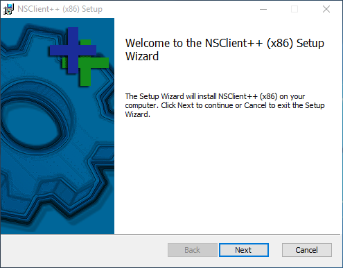

Luego elegimos la herramienta de monitoreo _Generic_:

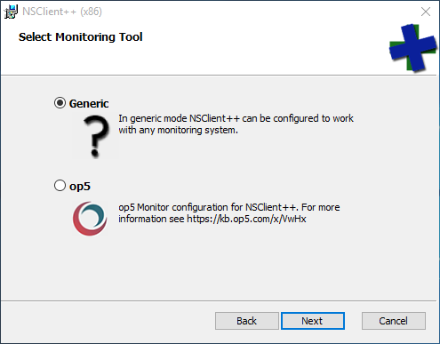

A continuación, seleccionamos el tipo de instalación _Typical_:

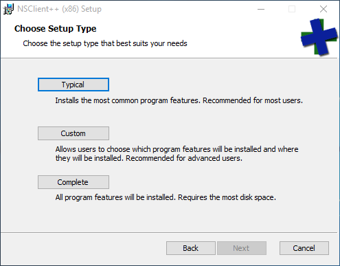

Llegados a este punto, ingresamos: 

* La dirección IP local (127.0.0.1)
* La dirección IP del servidor Nagios, separada de la anterior con una coma [,]
* Una contraseña a elección (¡no olvidar!)

Luego marcamos todas las casillas de verificación a excepción de _Enable NSCA client_ y presionamos el botón _Next_:

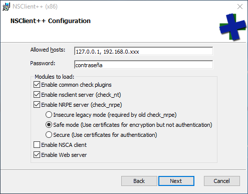

En este paso, presionamos _Install_:

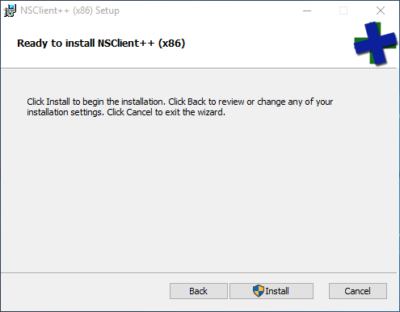

Y comenzará la Instalación...

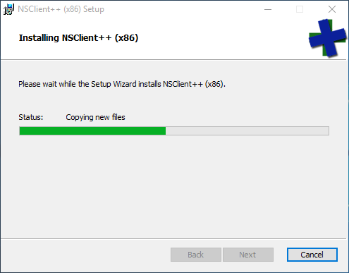

Segundos más tarde, la instalación habrá concluido. Clic en _Finish_ para cerrar el instalador.

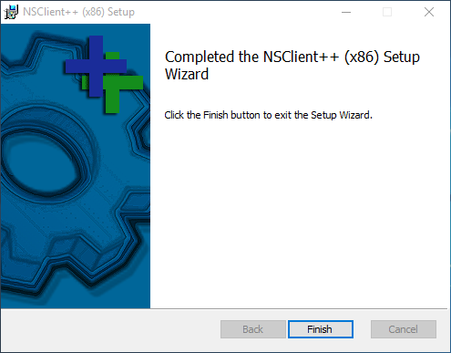

## Habilitando módulos de NSClient++

La interfaz web de _NSClient++_ ofrece información útil para verificar el correcto funcionamiento del agente y carga de los módulos. 

Para ello, en Windows accedemos a la siguiente dirección: `https://127.0.0.1:8443`

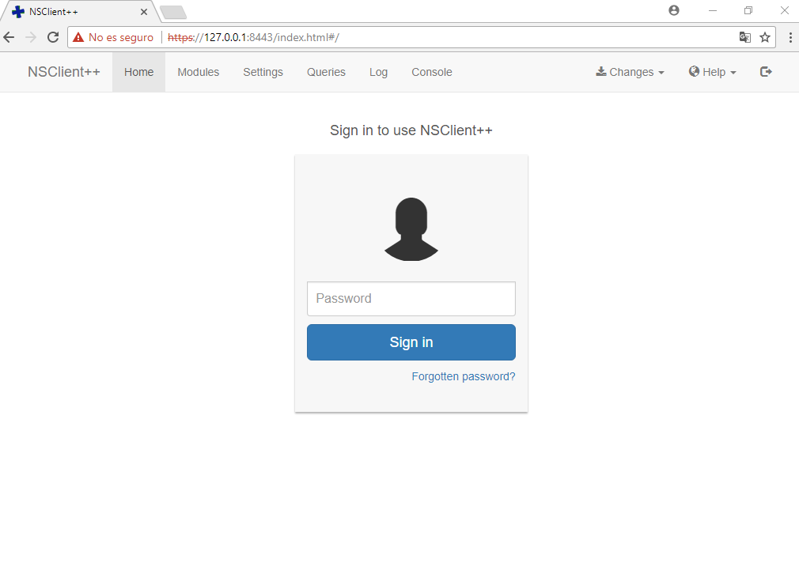

Una vez allí iniciamos sesión con la contraseña que definimos al momento de la instalación del cliente

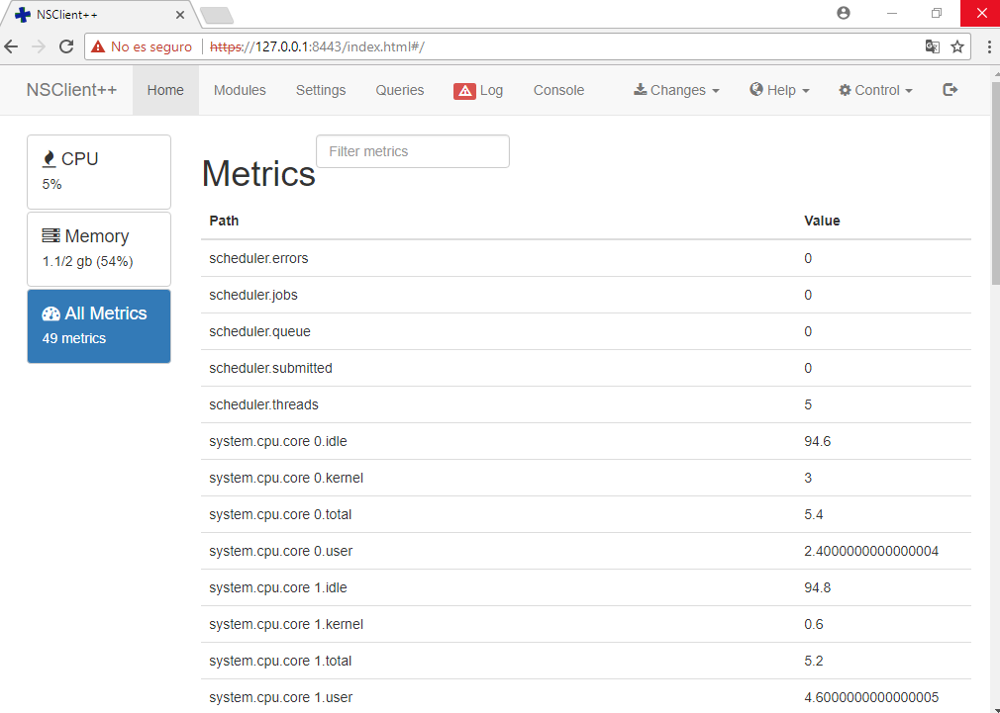

En el menú, seleccionamos "Modules" y _chequeamos_ aquellos que no lo estén, exceptuando los relacionados con _NSCA_: 

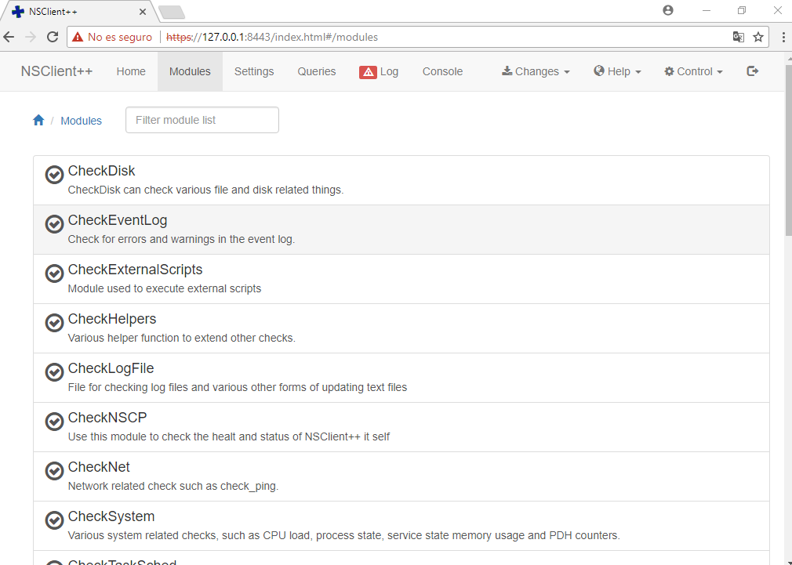

Por último, guardaremos los cambios: 

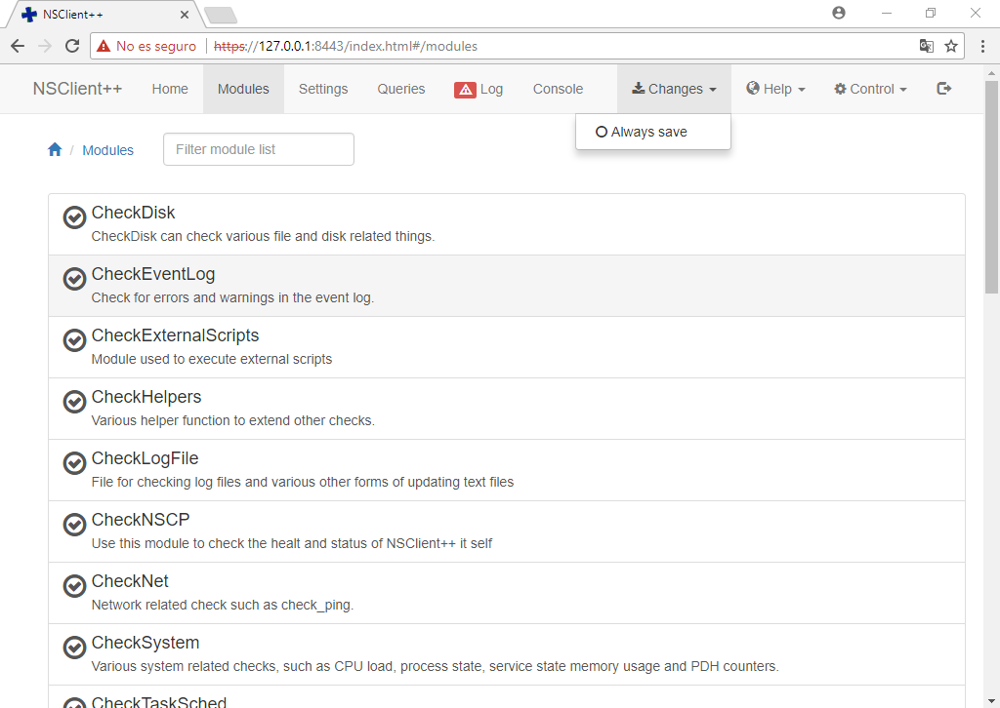


## Pasos opcionales para NSClient++  

En caso que el servicio presente problemas de funcionamiento podemos  realizar varias acciones, fundamentalmente relacionados con verificar que el servicio esté _corriendo_ y que los módulos -que serán los encargados de monitorear los distintos servicios en Windows- se hayan cargado correctamente.

### Cargando toda la configuración de NSClient++

Abrimos la terminal de Windows en **modo administrador** y nos desplazamos a la carpeta de instalación del agente de monitoreo: 

```bash
cd c:\Program Files\NSClient++
```

!!!tip "Acceder a la carpeta NSClient++ desde la terminal"
		Podemos desplazarnos con el mouse hasta la carpeta en cuestión y una vez allí, copiar y pegar la ruta completa hacia la misma desde la barra de direcciones. 

Y para cargar la configuración completa del cliente ejecutamos en la consola de Windows: 

```bash
nscp settings --generate --add-defaults --load-all
```

!!!note "Salida del comando"
		El comando, en caso de ser correcto, no produce ninguna salida. Tampoco debemos preocuparnos si leemos el mensaje “Failed to register plugin”. 

### Habilitando los módulos manualmente

Con un editor de texto plano serio (como Notepad++, Sublime Text, Visual Studio Code, Brackets, etc. ¡_Notepaders_, abstenerse!) abrimos el archivo `nsclient.ini` ubicado en la carpeta de instalación del programa. En este ejemplo, usamos _Notepad++_:

```bash
start notepad++ nsclient.ini
```

!!!note "Abrir el editor en modo gráfico"
		Si no deseamos usar la termial, podemos abrir el editor de texto en **modo administrador** y luego el archivo `nsclient.ini` ubicado, como se indicó mas arriba, en la carpeta de instalación del programa. 

		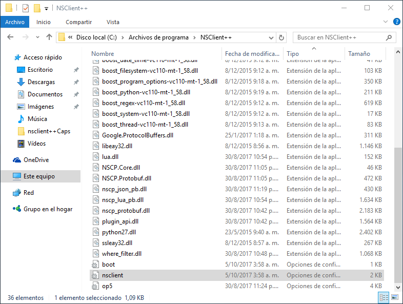

Luego, habilitamos manualmente los módulos que figuran como deshabilitados (_disabled_), a excepción de los relacionados con _NSCA_, de modo que el bloque quete de la siguiente manera: 


```bash
[/modules]

; Undocumented key
CheckExternalScripts = enabled

; Undocumented key
CheckNSCP = enabled

; Undocumented key
CheckEventLog = enabled

; Undocumented key
CheckDisk = enabled

; Undocumented key
CheckSystem = enabled

; Undocumented key
CheckHelpers = disabled

; Undocumented key
WEBServer = enabled

; Undocumented key
NSClientServer = enabled

; Undocumented key
NRPEServer = enabled

```


### Verificando que NSClient++ se esté ejecutando

En Windows abrimos el diálogo _Ejecutar_ pulsando las teclas `Windows` + `r` y ejecutamos `services.msc`

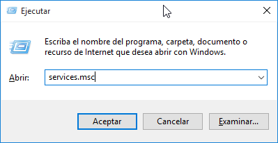

Hacemos clic derecho sobre el servicio _NSClient++ Monitoring Agent_ y seleccionamos la opción _Propiedades_ del menú contextual

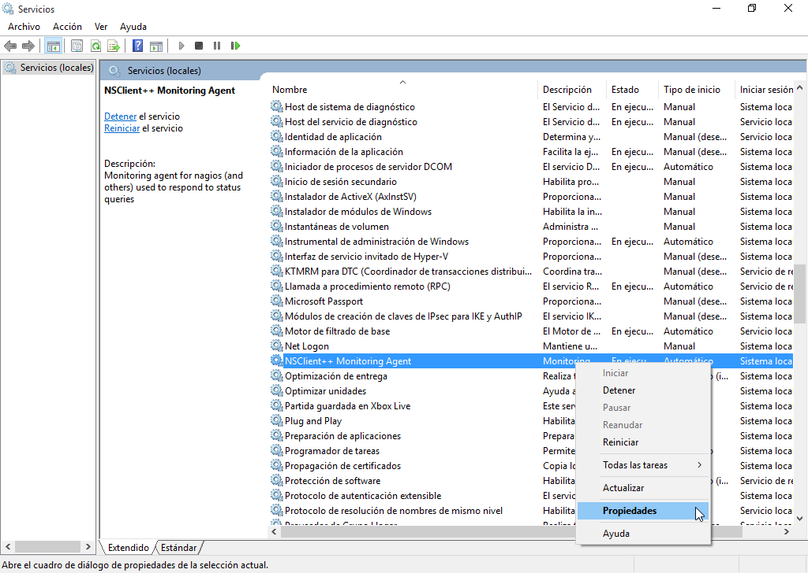

Verificamos que el servicio _NSClient++_ este iniciado y seteado como automático.

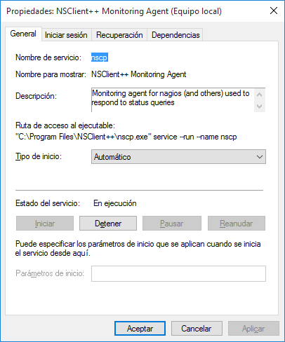

Elegimos la pestaña _Iniciar sesión_. Allí tildaremos la opción _Permitir que el servicio interactúe con el escritorio_. 

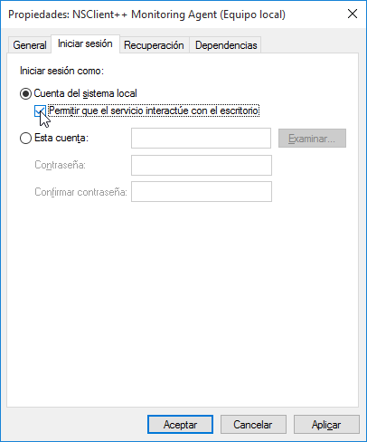

Adicionalmente, podemos detener o iniciar desde la terminal de comandos de Windows. Para ello, abrimos la terminal en **modo administrador** y ejecutamos para detener el servicio: 

```bash
net stop nscp
```

Y para iniciarlo: 

```bash
net start nscp
```

### Verificando puertos de esucha de NSClient++

Para verificar puerto de NSClient++ abierto: 

```bash
netstat -an | findstr 12489
```

Para abrir los puertos del firewall en Wnidows:

```powershell
netsh advfirewall firewall add rule name="NSClient UPD" dir=in action=allow protocol=UDP localport=12489

netsh advfirewall firewall add rule name="NSClient UPD" dir=out action=allow protocol=UDP localport=12489

netsh advfirewall firewall add rule name="NSClient TCP" dir=out action=allow protocol=TCP localport=12489

netsh advfirewall firewall add rule name="NSClient TCP" dir=in action=allow protocol=TCP localport=12489
```

Si al cargar los módulos NSClient++ obtenemos un error, debemos agregar al archivo nsclient.ini

[/settings/NSClient/server]
port = 12489


## Configurando NSClient++ en el servidor Nagios

Antes de continuar, es conveniente crear una copia de seguridad del archivo que modificaremos: 

```bash
sudo cp /etc/nagios-plugins/config/nt.cfg /etc/nagios-plugins/config/nt.cfg.original
```

Acto seguido, abrimos el archivo **nt.cfg**:  

```bash
sudo vim /etc/nagios-plugins/config/nt.cfg
```

Y procederemos a modificar el archivo de tal manera que sólo debería quedarnos las siguientes líneas: 

```apache
define command {
command_name   check_nt
command_line   /usr/lib/nagios/plugins/check_nt -H $HOSTADDRESS$ -p 12489 -s contraseña -v $ARG1$ $ARG2$
}
```

Donde **contraseña**, es la clave elegida durante la instalación del agente NSClient++.

Por último, tendremos que [verificar la configuración y reiniciar el servidor Nagios](configuracion/#verificando-la-configuracion-y-reiniciando-nagios) para guardar los cambios que hayamos introducido.


