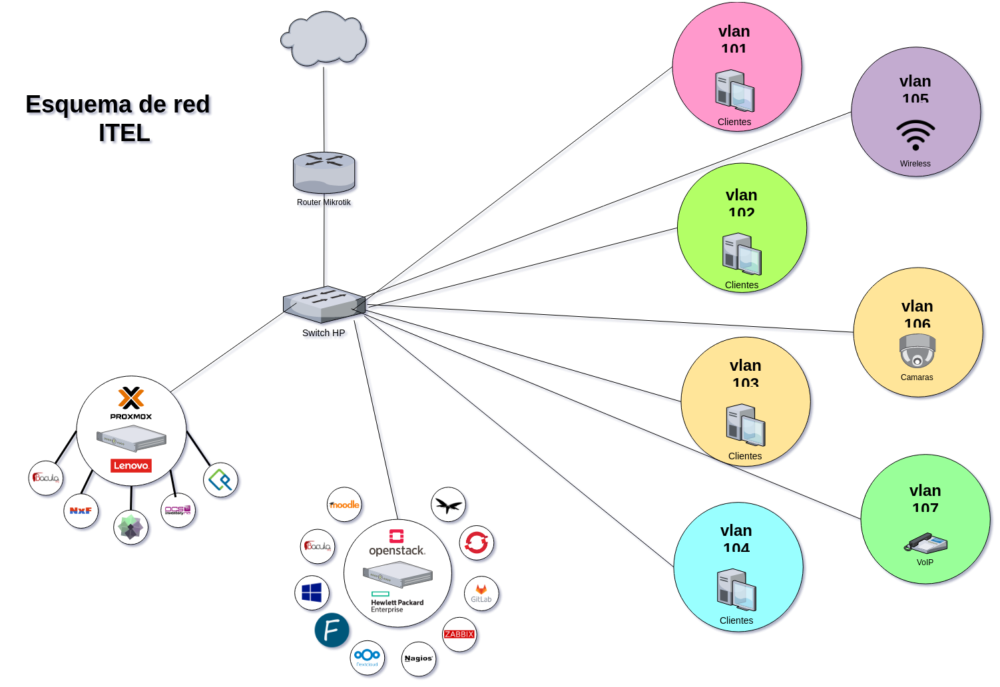

# Herramientas de sotware

Listado de herramientas de software para desplegar y testear antes de su uso en producción en el instituto. 

## Gestión de equipos de trabajo
* [IceScrum](https://www.icescrum.com/)
* [Kanboard](https://kanboard.org/)
* [Phabricator](https://phacility.com/phabricator/)
* [Redmine](https://www.redmine.org)
* [Taiga](https://taiga.io/)
* [Taskboard](https://taskboard.matthewross.me/)

## Documentación e inventario
* [NetBox](https://netbox.readthedocs.io/en/stable/)
* [OCS Inventory](https://ocsinventory-ng.org/?lang=en)

## Web Filters
* [Apache Traffic Server](https://trafficserver.apache.org/)
* [Artica Proxy](http://artica-proxy.com/)
* [Hosts](https://github.com/StevenBlack/hosts)
* [NxFilter](https://nxfilter.org/p3/)
* [Pi-Hole](https://pi-hole.net/)

## Backup
* [Bacula](https://www.bacula.org)
* [Duplicati](https://www.duplicati.com/)
* [RClone](https://rclone.org/)
* [Syncthing](https://syncthing.net/)

## Gestión de usuarios
* [CAS](https://apereo.github.io/cas/6.0.x/index.html)
* [FreeIPA](https://www.freeipa.org/page/Main_Page)
* [KeyCloak](https://www.keycloak.org/)
* [OpenLDAP](https://www.openldap.org/)
* [RazDC](http://razdc.com/)

## Gestión de sistemas operativos
* [Clonezilla](https://clonezilla.org)
* [Fog Project](https://fogproject.org/)

## Gestión de servicios
* [Admin4](http://www.admin4.org/)
* [AegiProject](http://www.aegirproject.org/)
* [Ajenti](http://ajenti.org/)
* [ApacheGUI](http://www.apachegui.net/)
* [AtomiaDNS](http://atomiadns.com/)
* [Cockpit](https://cockpit-project.org/)
* [FacileManager](http://facilemanager.com/) 
* [Froxlor](https://www.froxlor.org/)
* [ProBIND](https://pacoorozco.github.io/probind/) 
* [Sentora](http://sentora.org/)
* [Vesta](https://vestacp.com/)
* [Webmin](http://www.webmin.com/)

## Nube privada
* [IPFS](https://ipfs.io/)
* [NextCloud](https://nextcloud.com/)
* [OwnCloud](https://owncloud.org/)
* [Pydio](https://pydio.com/en)
* [Sotrj](https://storj.io/)

## Base de conocimiento
* [BokStack](https://www.bookstackapp.com/)
* [DocPress](https://docpress.github.io/)
* [Docute](https://docute.org/)
* [DocFX](https://dotnet.github.io/docfx/)
* [Dokuwiki](https://www.dokuwiki.org)
* [FosWiki](http://foswiki.org/)
* [Jigsaw](https://jigsaw.tighten.co/)
* [MkDocs](https://www.mkdocs.org/)
* [SkyDocs](https://skydocs.skyost.eu/en/)
* [Raneto](http://raneto.com/)
* [Wiki.js](https://wiki.js.org/)

## Red social
* [Elgg](https://elgg.org/)
* [HumHub](https://www.humhub.org/en)
* [Movim](https://movim.eu/)
* [OSSN](https://www.opensource-socialnetwork.org/)

## HelpDesk
* [GLPI](https://glpi-project.org/)
* [Open Supports](https://www.opensupports.com/)
* [OTRS](https://community.otrs.com/)
* [Request Tracker](https://bestpractical.com/request-tracker)
* [Zammad](https://zammad.org/)

## Mensajería
* [Keybase](https://keybase.io/)
* [Mattermost](https://mattermost.com/)
* [Mibew](https://mibew.org/es/)
* [Mumble](https://wiki.mumble.info/wiki/Main_Page)
* [Riot](https://about.riot.im/)
* [RocketChat](https://rocket.chat/)
* [Tox](https://tox.chat/)
* [Zulip](https://zulipchat.com/hello/)

## DevOps
* [Ansible](https://www.ansible.com/)
* [Git Lab](https://about.gitlab.com/)
* [Gitea](https://gitea.io/en-us/)
* [Jenkins](https://jenkins.io/)
* [OpenShift](https://www.openshift.com/)
* [WildFly](https://wildfly.org/)

## Monitoreo
* [Alerta](https://alerta.io/)
* [Cabot](https://cabotapp.com/)
* [Cacti](https://www.cacti.net/)
* [Checkmk](https://checkmk.com/)
* [Cicada](https://github.com/little-brother/cicada) 
* [Centreon](https://www.centreon.com/en/solutions/centreon/)
* [EyesOfNetwork](https://www.eyesofnetwork.com/)
* [Graphite](https://graphiteapp.org/)
* [LibreNMS](https://www.librenms.org/)
* [NAV](https://nav.uninett.no/)
* [Monit](https://mmonit.com/monit/)
* [Monitorix](https://www.monitorix.org/)
* [Munin](http://munin-monitoring.org/)
* [Nagios](https://www.nagios.org/)
* [Netdata](https://www.netdata.cloud/)
* [Netxms](https://www.netxms.org/)
* [OpenNMS](https://www.opennms.com/)
* [PandoraFMS](https://pandorafms.org/es/)
* [PHP Server Monitor](http://www.phpservermonitor.org/)
* [phpSysInfo](https://phpsysinfo.github.io/phpsysinfo/)
* [Smokeping](https://oss.oetiker.ch/smokeping/)
* [Zabbix](https://www.zabbix.com/)

## Plataformas de virtualizacion
* [Apache Mesos](https://mesos.apache.org/)
* [Danube Cloud](https://danubecloud.org/)
* [Docker](https://www.docker.com/)
* [Kubernetes](https://kubernetes.io/es/)
* [Nebula](https://nebula-orchestrator.github.io/)
* [Nomad](https://www.nomadproject.io/)
* [OpenStack](https://www.openstack.org/) 
* [Proxmox](https://www.proxmox.com/en/proxmox-ve)
* [UVMM](https://www.univention.com/products/ucs/functions/virtualization-uvmm/)
* [Vamp](https://nebula-orchestrator.github.io/)
* [XCP-ng](https://xcp-ng.org/)

## PaaS
* [CapRover](https://caprover.com/)
* [CloudFoundry](https://www.cloudfoundry.org/)
* [Cloudify](https://cloudify.co/)
* [Dokku](http://dokku.viewdocs.io/dokku/)
* [Ethibox](https://ethibox.io/)
* [NanoBox](https://nanobox.io/)
* [Polemarch](https://polemarch.org/)
* [Portainer](https://www.portainer.io/)
* [Rancher](https://rancher.com/)

## IDE
* [Plunker](http://plnkr.co/)
* [Theia](https://www.theia-ide.org/)
