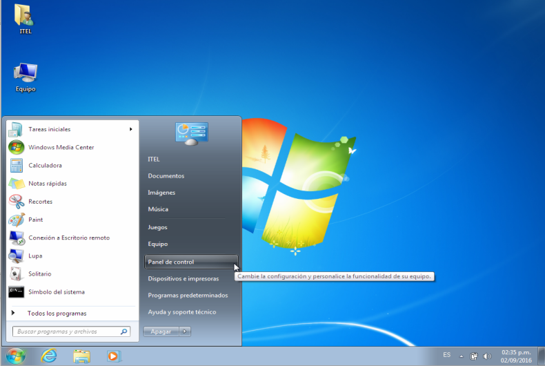
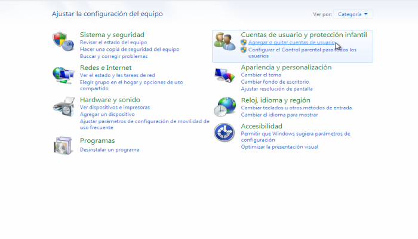
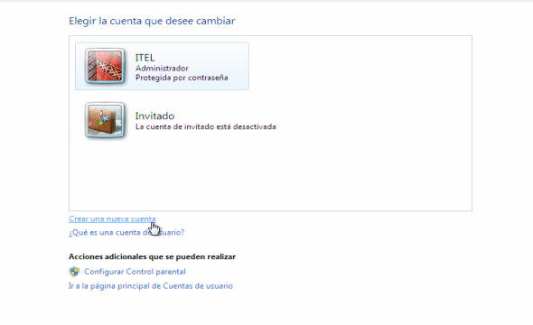
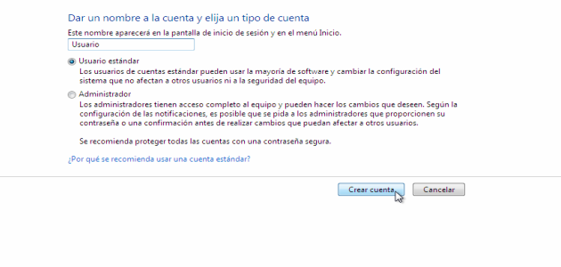
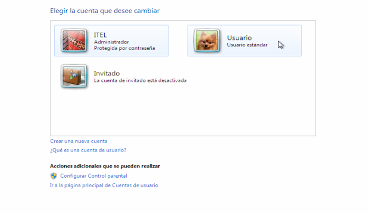
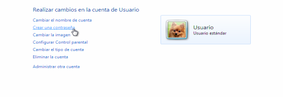
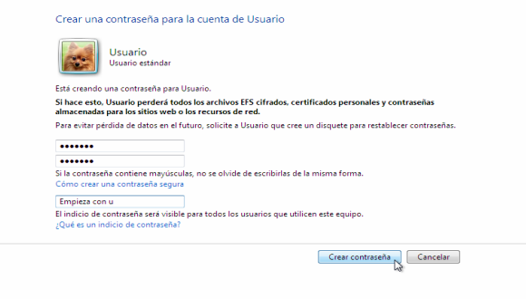

# Gestión de usuarios
Para compartir carpetas entre equipos con **Windows** y **GNU/Linux**, tendremos que configurar usuarios en ambos sistemas.  

!!!done "Sobre los usuarios"
		Es recomendable, aunque no excluyendete,  disponer de **los mismos usuarios** tanto en el servidor **SAMBA**, como en **Windows** para un correcto funcionamiento del servicio.

## Creación de usuarios en GNU/Linux
A continuación, repasaremos el modo de creación de usuarios en GNU/Linux:

```bash
sudo adduser usuario
```
Donde `usuario` es el nombre de usuario que deseamos crear. El mismo nombre de usuario debe existir en Windows. Recordar que en GNU/Linux, los nombres de usuario son sensibles a letras mayúsculas y minúsculas. 

## Creación de grupos en GNU/Linux 
Cuando creamos un usuario en GNU/Linux, automáticamente **el sistema crea un grupo con el mismo nombre que el usuario**. Sin embargo, podemos agregar los grupos que querramos de la siguiente manera: 

```bash
sudo addgroup nuevoGrupo
```
Donde `nuevoGrupo` es el nombre de grupo que deseamos crear. 


## Agregando usuarios a un grupo en GNU/Linux 

Podemos modificar o agregar los grupos a los que pertenece el usuario de la siguiente manera: 

```bash
sudo usermod -G grupo1,grupo2 usuario
```
Donde `usermod` es el comando para agregar al usuario llamado `usuario` a los grupos `grupo1` y `grupo2`  

!!!tip "Gestionando usuarios y grupos de manera simultánea"
		Es posible crear un **usuario** y **agregarlo a un grupo** determinado por nosotros, **de manera simultánea**:

		```
		sudo useradd usuario -m -G users
		```

		Pero si usamos este método, deberemos configurar la contraseña del usuario en un segundo paso: 

		```
		sudo passwd usuario
		```


## Verificando a que grupos pertenece un usuario en GNU/Linux
Para verificar el/los grupo/s a los que pertenece el usuario, ejecutamos: 

```apache
sudo id usuario
```
Donde `usuario`, es el usuario que deseamos investigar. 

## Agregando usuarios al servidor SAMBA 
Los usuarios ya fueron creados en GNU/Linux. Sólo resta agregarlos al servidor SAMBA de la siguiente manera: 

```apache
sudo smbpasswd -a usuario
```

Donde `usuario` es el usuario al que deseamos agregar a SAMBA. El sistema nos solicitará la contraseña del usuario en SAMBA que deberá ser la misma que en Windows.


## Creación de usuario en Windows 7
Para el correcto funcionamiento de SAMBA es recomendable que existan en Windows los mismos usuarios que en el servidor de compartición. En otro tutorial se explica como crear y gestionar los usuarios en GNU/Linux. A continuación, se detallan los pasos para la creación de usuarios en Windows 7. 

### Paso 0


### Paso 1


### Paso 2


### Paso 3


### Paso 4


### Paso 5


### Paso 6


!!!warning "Sobre la creación de usuarios en Windows"
	GNU/Linux es un sistema _case sensitive_, es decir, discrimina las mayúsculas de las minúsculas. Por ejemplo, `juan` y `Juan` son vistos por el sistema como dos usuarios diferentes. Hay que tener en cuenta este punto al crear los usuarios en Windows, ya que deberán llamarse de igual manera que en el servidor GNU/Linux. 